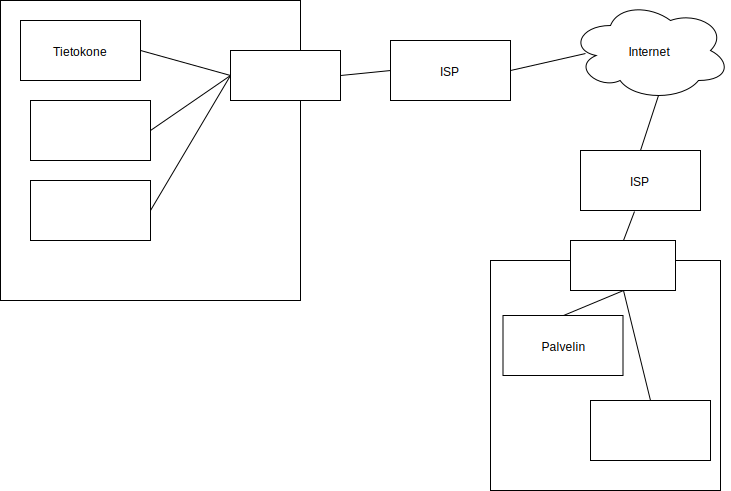

<lead>
Lähes kaikki palvelut ja koko yhteiskunta toimii ja luottaa siihen, että viestejä voidaan välittää henkilöltä toisella ja laitteelta toiselle. Kaikki siis olettavat että tietoliikenne toimii. Tietoliikennettä tarvitsevat esimerkiksi puhelut, verkkosivujen selailu, videoiden katselu tietokoneella tai kännykällä, mutta myös uudet älykkäät kodinkoneet olettavat voivansa käyttää tietoverkkoja. Käydään siis aluksi läpi tietoverkkoja ja niiden toiminnallisuuksia.
</lead>

## Tietoverkko ja sen käsitteitä

Tietoverkoilla yhdistetään toisiinsa tietokoneita, jotka haluavat kommunikoida keskenään. Ihmiset keskustelevat, mutta laitteet kommunikoivat. Aluksi meidän täytyykin käyttää aikaa erilaisten asioiden nimeämiseen. Sanastokeskus TSK on vuosien aikana laatinut useita sanastoja eri teemoista [(http://www.tsk.fi/tsk/fi/tsksarja-68.html)](http://www.tsk.fi/tsk/fi/tsksarja-68.html). Kurssin kannalta kiinnostavin on laajakaistasanasto, mutta muissakin sanastoissa on paljon hyödyllistä termistöä kurssin tarpeisiin.

Hyvä esimerkki nimeämisen ongelmista on se, että olisin äskeistä www-osoitetta voinut kutsua myös nettiosoitteeksi tai URL-osoitteeksi. Nämä kaikki nimet ovat noissa sanastoissa ja vaikka ne lähtökohtaisesti tarkoittavat samaa merkkijonoa, niin eri käyttötilanteissa on käytetty eri nimeä ja siksi samalla asialla voi olla useita nimiä. Näistä tuo www-osoite tulee taustaltaan englanninkielisestä World Wide Web (WWW) käsitteestä. URL-osoite puolestaan on ottanut tuon alkuosansa englanninkielisestä Uniform Resource Locator (URL), jossa se on määritelmänsä mukaan merkkijono, jolla voidaan osoittaa www-sivun paikkaa. Nettiosoite ei suoraan sitoudu juuri www-palveluun ja siihen liittyvään käsitteistöön, vaikka sitä usein vain tähän palveluun liittyen käytetäänkin.

Itse asiassa tuossa sanastojen osoitteessa on monta eri osaa. Käydään ne nyt läpi pikaisesti ja palataan niihin myöhemmin.

* alkuosa http kertoo meille, että kyseessä on HTTP protokolla, eikä sen salattu versio, joka olisi https.
* keskiosa www.tsk.fi on tietyn laitteen tai palvelun verkkonimi
* loppuosa /tsk/fi/tsksarja-68.html puolestaan kertoo tuolle palvelulle, minkä verkkosivun haluamme nähdä.

[Sanastokeskus TSK](http://www.tsk.fi/tsk/):n [Tietotekniikan termitalkoot](http://www.tsk.fi/tsk/termitalkoot/) -sivustolta on mahdollista etsiä näitä käsitteitä ja niiden kuvauksia ilman, että täytyy tietää missä sanastossa se on esitelty. Jos eri asioiden nimet ja käsitteiden selitykset kiinnostavat, niin tätä sivustoa kannattaa käyttää. Kurssin aikana se toivottavasti auttaa uusien käsitteiden opiskelua, jos käsite jää tässä materiaalissa kuitenkin oudoksi. Jotta sanaston käyttö tulisi hiukan tutummaksi, niin käy katsomassa ainakin [tietoverkko-käsitteen käsitekaaviota](http://www.tsk.fi/tsk/termitalkoot/haku-266.html?page=resurssi&tiedosto=tietoverkko.svg). Kurssin kuluessa tutustumme lähes kaikkiin näistä termeistä.

 <quiz id="5c1ce20564cf001162cb949d"> </quiz> 

## Internet

Internet on englanninkielisen nimensä mukaisesti verkkojen verkko. Se siis yhdistää tietoverkkoja toisiinsa. Sitä voi kuitenkin ajatella myös yhtenä isona tietoverkkona, jonka sisällä on muita pienempiä tietoverkkoja. Käytän materiaalissa suomenkielistä termiä tietoverkko silloinkin, kun internet olisi ehkä täsmällisempi nimitys. Kolmas termi, jota usein käytetään, on tietoliikenneverkko. Sillä kuitenkin usein viitataan esim. puhelinverkkoon tai muuhun erikoistarkoitukseen rakennettuun verkkoon. Usein näitä kolmea termiä (internet, tietoverkko, tietoliikenneverkko) käytetään myös toistensa synonyymeinä.

Näitä internetiin liitettyjä tietoverkkoja hallinnoivat palveluntarjoajat (Internet service provider, ISP). Suomessa toimii kymmeniä palveluntarjoajia, joista tavalliselle kuluttajalle tunnetuimpia ovat teleoperaattorit kuten DNA, Elisa ja Telia. Helsingin yliopistolle kuten muillekin suomalaisille yliopistoille ja korkeakouluille internet yhteyden palveluntarjoajana toimii [CSC - Tieteen tietotekniikan keskus](https://www.csc.fi/). Se hallinnoi FUNET-verkkoa, jonka kautta Helsingin yliopiston internet yhteydet kulkevat. FUNET-verkko on puolestaan liitetty muuhun internetiin [FICIXin](https://www.ficix.fi/fi/) operoiman internetliikenteen yhdysliikennepisteen (internet exchange point) kautta. FICIXin yhdysliikennepiste on tietoverkko, joka puolestaan on liitetty eurooppalaisen yhdysliikennepisteen tietoverkkoon, joka puolestaan taas on liitetty edelleen muiden organisaatioiden tietoverkkoihin ja niin edelleen.  Näin internet verkkona rakentuu toisiinsa liitetyistä palasista. Sillä ei ole yhtä keskitettyä hallitsevaa organisaatiota. Jokaisen yksittäisen verkon omistaja päättää oman verkkonsa toiminnasta. Omistaja voi esimerkiksi irrottaa oman verkkonsa muista tai vaihtaa omaa yhteyspistettään.

FICIX julkaisee tilastotietoa sen verkon kautta kulkeneesta liikenteestä. Tilastosta on tarjolla myös [graafinen kuva](https://stats-ficix.basen.com/#/page?name=StatsWelcome&source=wiki)

 <quiz id="5c1ce4a1054d71123e35cb5b"> </quiz> 

Internetin keskeisin ominaisuus onkin sen kyky siirtää viestejä tietoverkosta toiseen. Tämän tekevät verkkoja yhdistävät [reitittimet](https://fi.wikipedia.org/wiki/Reititin) (engl. router), jotka vastaanottavat viestin yhdestä verkosta ja välittävät sen edelleen toiseen verkkoon. Kahden eri verkon välissä on aina reititin, joka huolehtii viestien siirtämisestä verkkojen välillä. Usein kummassakin verkossa on oma reitittimensä, joka poimii omasta verkosta ulospäin menevät viestit välitettäväksi toiseen verkkoon.
Jos olet kiinnostunut täysin tämän kurssin ulkopuolisesta ylimääräisestä lisätiedosta, niin [FUNET-verkkoa kuvaavalla sivulla](https://wiki.eduuni.fi/display/funet/IP-yhteydet) kerrotaan lisää siitä, miten eri yliopistot tai korkeakoulut voivat omat verkkonsa liittää FUNETin verkkoon.

Internetin kommunikointitavat on standardoitu ja kaikki internetissä tapahtuva kommunikointi noudattaa näitä standardeja. Internetin standardoinnista huolehtii [Internet Engineering Task Force (IETF)](https://www.ietf.org/). IETF:n standardeja puhutellaan lyhenteellä RFC. Niiden numerointi alkoi aikoinaan numerosta 1, mutta uusimmat numerot ovat jo yli 8500. RFC:t määrittelevät erilaisia internet-verkon ominaisuuksia. Jo hyväksyttyä standardia ei enää muuteta, vaan muutokset kirjataan uudeksi RFC:ksi, joka joko täydentää edellistä tai korvaa sen kokonaan.

## Internetlaitteet ja verkkolaitteet

Internetlaitteita ovat kaikki internetiin kytketyt päätelaitteet, jotka ovat verkon reunalla eivätkä välitä liikennettä muille. Verkkolaitteita puolestaan laitteet, jotka toimivat verkon sisällä ja huolehtivat viestien siirtämisestä paikasta toiseen.

Näin ollen käyttäjän tabletti, älypuhelin tai tietokone on tässä jaottelussa internetlaite silloin, kun se on kytkettynä internet-verkkoon. Myös erilaisten organisaatioiden www-sivuja jakavat www-palvelimet ovat internet-verkon päätelaitteita. Ne eivät välitä liikennettä eteenpäin vaan ovat kiinni verkossa ja vastaanottavat ja lähettävät viestejä samaa yhteyttä käyttäen.

Verkkolaitteita ovat puolestaan laitteet, jotka ovat verkon sisäpuolella. Niiden tyypillisin tehtävä on yhdistää isomman verkon osia, aliverkkoja, toisiinsa. Reititin mainittiinkin jo aiemmin tällaiseksi verkkoja yhdistäväksi laitteeksi. Muita paljon käytettyjä laitteita ovat [kytkimet](https://fi.wikipedia.org/wiki/Kytkin_(tietoliikenne)) (engl. network switch) ja erilaiset modeemit.

Kotiverkossa saattaa olla ADSL-modeemi, joka yhdistää sen internetpalvelua tarjoavan teleoperaattorin verkkoon. Aiemmin ADSL-modeemi oli vain ADSL-modeemi. Nykyään kyseessä yleensä on monitoimilaite, joka samalla toimii reitittimenä ja saattaa sisältää muitakin internet-verkon toiminnallisuuksia, kuten langattoman verkon (WLAN, WiFi) tukiasema.

 <quiz id="5bf6a05dcd84693e7889b274"> </quiz> 

## Palvelin ja palvelu

Ennen kuin siirrytään eteenpäin, niin tutustutaan vielä yhteen käsitepariin palvelu ja palvelin.

Helposti puhumme sekä www-palvelusta että www-palvelimesta. Epätäsmällisessä puheessa ne voivat jopa tarkoittaa samaa asiaa, mutta täsmällisemmässä määrittelyssä niillä on ihan selkeä ero.

[Tietotekniikan termitalkoiden](http://www.tsk.fi/tsk/termitalkoot/) määrittelyt näille käsitteille ovat:
<ul>
  <li>Palvelu (engl. service) on palvelimessa toimiva ohjelma, joka tarjoaa standardoitujen internetyhteyskäytäntöjen avulla palveluja sovellusten käytettäväksi.
   <li>Palvelin (engl. server) puolestaan on tietokone, ohjelmisto tai näiden yhdistelmä, joka hoitaa tiettyjä tehtäviä muiden samaan verkkoon kytkettyjen tietokoneiden pyyntöjen ohjaamana tai niiden puolesta.
</ul>

Eli kun puhumme palvelusta, tarkoitamme jotain isompaa kokonaisuutta, jota tarjotaan muille käytettäväksi. Palvelin on taas osa tietoverkkoa, jonka avulla tuo palvelu voi olla muiden käytettävissä.

Usein palvelua käyttävistä sovelluksista ja oikeammin niistä laitteista, joilla niitä suoritetaan, käytetään termiä asiakas (engl. client). Sovelluksesta voidaan tarvittaessa käyttää termiä asiakasohjelma. Tietoliikenteessä asiakas ei siis koskaan ole ihminen, vaan ihmisestä käytetään termiä 'käyttäjä', koska hän käyttää kyseistä sovellusta tai laitetta.

Seuraavassa aliluvussa tarkastellaankin miten viestinvaihto viestin lähettäjän ja vastaanottajan välillä oikein tapahtuu.

 <quiz id="5c73f865fd9fd71425c674b7"> </quiz> 

<key-terminology
  terminologies='[
       {"title":"internet", "content":"IETF:n standardia noudattava maailmanlaajuinen verkkojen verkko"},
         {"title":"reititin", "content":"Reititin yhdistää aliverkkoja toisiinsa ja osaa siirtää liikennettä verkon osasta toiseen."},
       {"title":"www-osoite", "content":"www-palvelun tai sen tarjoaman yksittäisen sivun osoite."},
       {"title":"internetpalvelun tarjoaja", "content":"ISP tarjoaa asiakkailleen yhteyden internet verkkoon oman verkkonsa kautta."},
       {"title":"internet liikenteen yhdyspalvelupiste", "content":"Yhdyspalvelupiste tarjoaa omille asiakkailleen mahdollisuuden välittää viestejä toisten asiakkaiden verkkoihin. Yhdyspalvelupisteen asiakkaat ovat internetpalveluntarjoajia."},
       {"title":"kytkin", "content":"Välittä liikennettä yhden aliverkon sisällä sen osasta toiseen."}
  ]'>
</key-terminology>

