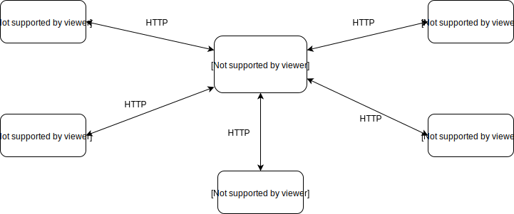
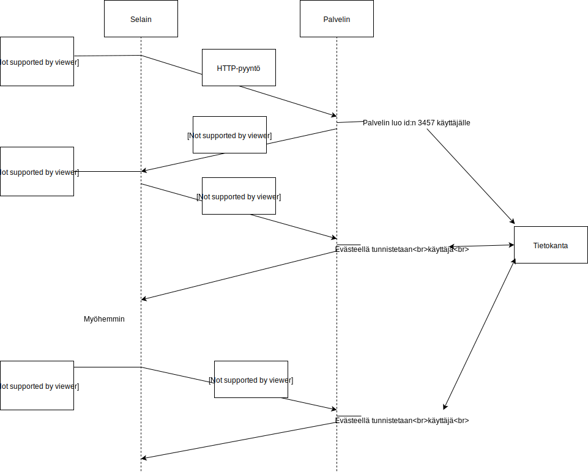
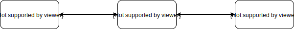

<text-box variant='learningObjectives' name='Oppimistavoitteet'>


- Tiedät miten http protokollana toimii
- Osaat kertoa millainen protokollan viestin rakenne on ja millaisia arvoja eri kentillä on
- Hahmotat myös miten protokollan toiminnallisuuteen vaikuttaa viestin rakenne ja kenttien arvot

</text-box>


## WWW-palvelu


Ykkösosiosta toivottavasti muistat, että WWW-sivuihin viitataan URL-osoitteella. Esimerkiksi tämän sivun URL-osoite on https://tietorakenteet-ja-algoritmit-s19.mooc.fi/osa-3/2-www-ja-http. Osoitteen alku https kertoo, että kommunikointi web-selaimen ja web-palvelimen välillä tapahtuu käyttäen HTTPS-protokollaa. Se on HTTP-protokollan salattu versio. Tällä kurssilla tutustumme HTTP-protokollaan, jota ei ole salattu. Seuraava osa tietorakenteet-ja-algoritmit-s19.mooc.fi on web-palvelimen nimi. Tämän nimen perusteella tietoliikenteessä osataan ensin hakea laitteen oikea IP-osoite DNS-nimipalvelun avulla. Koska näitä sivuja jakava web-palvelin toimii googlen pilvipalvelulla, niin eri käyttäjät voivat saada sille eri IP-osoitteen. Minulle sivut tulivat juuri äsken IP-osoitteesta 130.211.93.80.

Web-palvelimet ja web-selaimet käyttävät omaan keskinäiseen kommunikointiinsa HTTP-protokollaa. HTTP-protokolla on meidän ihmisten kannalta sikäli kiva, että se on tekstipohjainen, joten meidän on helppo lukea protokollan viestejä ja niiden sisältöjä. Jotkut muut protokollat siirtävät viestejä binäärilukuina. Yksi esimerkki tällaisesta protokollasta on HTTP:stä kehitetty salattu versio HTTPS.




## HTTP - protokolla

Ensimmäisessä versiossa HTTP-protokollasta oli määritelty vain sivun noutoon tarvittavat GET-pyyntö ja siihen liittyvä vastaus. Nämä ovat edelleen eniten käytetyt HTTP-protokollan viestit. Uudemmassa protokollassa on lisäksi paljon enemmän viestityyppejä, joiden avulla nettiselain voi myös antaa tietoja palvelimelle eikä vain pyytää siltä tietoja. Tämän kurssin osalta tarkastelemme lähinnä GET-pyyntöä. Jos sinua kiinnostavat myös nuo muut viestityypit, niin [wikipedian artikkelissa](https://fi.wikipedia.org/wiki/HTTP) on lyhyet kuvaukset niistä.

HTTP on siis siirtoprotokolla, joka huolehtii www-sivun sisällön siirtämisestä palvelimelta asiakkaalle. Siirto tapahtuu asiakkaan pyynnöstä.  HTTP:n kaikki sanomat ovat tekstimuotoisia, joten niitä on ihmistenkin helppo lukea. Esimerkiksi oheinen suoraan [wikipedian sivulta](https://fi.wikipedia.org/wiki/HTTP) lainattu GET-pyyntö


<text-box variant='example' name='HTTP Get pyyntö'>

```
GET /wiki/HTTP HTTP/1.1
Host: fi.wikipedia.org
User-Agent: Mozilla/5.0 (Windows; U; Windows NT 5.1; fi-FI; rv:1.6) Gecko/20040206 Firefox/0.8
Accept: application/x-shockwave-flash,text/xml,application/xml,application/xhtml+xml,text/html;q=0.9,text/plain;q=0.8,video/x-mng,image/png,image/jpeg,image/gif;q=0.2,*/*;q=0.1
Accept-Language: fi,en;q=0.7,en-us;q=0.3
Accept-Encoding: gzip,deflate
Accept-Charset: ISO-8859-1,utf-8;q=0.7,*;q=0.7
Keep-Alive: 300
Proxy-Connection: keep-alive
Referer: http://fi.wikipedia.org/w/wiki.phtml?title=HTTP
Cache-Control: max-age=0
```

</text-box>


Tästä näkyy hyvin tuo viestin rakenne. Viesti alkaa sanalla GET, jota seuraa pyydettävän sivun tunniste /wiki/HTTP ja käytettävän protokollan nimi ja versionumero. Muut rivit ovat tähän viestin liittyviä määrämuotoisia attribuutteja. Kukin rivi alkaa attribuutin nimellä, jota seuraa kaksoispiste. Loppurivi on sitten kyseisen attribuutin arvo. Jotkut attribuutit ovat valinnaisia ja jotkut pakollisia. Esimerkiksi HTTP versio 1.1 edellyttää, että viestissä on aina Host-attribuutti, jonka arvona on sen www-palvelimen nimi, jolle viesti on osoitettu.

HTTP protokolla on tilaton (stateless). Tämä tarkoittaa sitä, että selaimen tai palvelimen ei tarvitse muistaa mitä oltiin tekemässä, vaan jokainen viestipari käsitellään muista irrallisena tapahtumana. Tämä muistamattomuus helpottaa sovelluksen suunnittelua ja toteutusta, kun ei tarvitse pitää kirjaa siitä mitä on aiemmin tehty.

HTTP käyttää TCP:tä viestien välittämiseen. TCP on yhteydellinen, joten asiakas (eli selain) ja palvelin voivat erikseen sopia yhteyden säilyttämisestä tulevia pyyntöjä varten tai palvelin voi sulkea yhteyden heti vastausviestin lähetettyään, jolloin asiakas joutuu avaamaan uuden yhteyden seuraavalle pyynnölle. Koska www-sivun muodostaminen yleensä edellyttää useita sivun elementtien pyyntöjä, niin usein asiakas ja palvelin sopivat yhteyden säilyttämisestä. Toisaalta yhteyden säilyttäminen tilanteessa, jossa lisäpyyntöjä ei tulekaan, kuormittaa palvelimen rajallisia yhteyksiä.

<quiz id="5c7fd0bdfd9fd71425c68ad3"></quiz>


## HTML - kuvauskieli

HTTP-protokolla ja sen viesteillä www-selain ja www-palvelin voivat siirtää www-sivun kuvauksen palvelimen tietovarastoista selaimelle, joka voi sen sitten näyttää käyttäjälle. HTTP-protokolla ei ota kantaa siihen mitä tuolla sivulla on tai miten sivu on rakennettu. Sitä varten on ihan oma HTML-kieli, jolla www-sivun sisältö yleensä kuvataan. Tällä sivun sisällön kuvaamisella ei ole mitään tekemistä tietoliikenteen kanssa ja siksi emme tuota HTML-kieltä tässä opiskele. Kielestä ja sen kehitysprosessista on suomenkielinen kuvaus [wikipedia-sivulla](https://fi.wikipedia.org/wiki/HTML). Jos haluat kurssin ulkopuolella tutustua tähän aiheeseen lisää, yksi mahdollisuus on lukea Jukka Korpelan [Web-julkaisemisen opas](http://jkorpela.fi/webjulk/all.html).

Tämä sisällön kuvauksen ja siirtoprotokollan välinen erillisyys on vahva ajattelumalli koko tiedonsiirron taustalla. Tiedonsiirrossa keskitytään vain siihen, että sisältö saadaan siirrettyä muuttumattomana paikasta toiseen, mutta ei oteta lainkaan kantaa siihen, mitä sisältöä siirretään. Tähän ajattelumalliin perustuvat useimmat sisältöä jakavat palvelut, kuten Facebook, Snapchat, Napster, Youtube, jne. Osalle näistä sisältöpalvelua tuottaville organisaatioille on viranomaisten taholta asetettu myöhemmin (tai jo alun perin) vaatimuksia myös sisällön valvontaan. Tästä palveluntarjoajan tekemästä oman palvelunsa verkkosisällön sensuroinnista olemme saaneet viime aikoina lukea myös uutisista, esimerkiksi Iltasanomissa oli kesällä 2018 artikkeli [Facebookin sensuuri iski – Jopa maalaus Jeesuksesta rikkoi siveyssääntöä](https://www.is.fi/digitoday/art-2000005768708.html).


## Evästeet

Eväste (engl. cookie) on Tietotekniikan termitalkoiden määritelmän mukaan aputiedosto tai tunniste, jonka sisältämiä tietoja voidaan käyttää selaimen ja palvelimen välisen yhteydenpidon ohjaamiseen.

Palvelimet käyttävät evästeitä, koska niiden avulla voi tavallaan kiertää edellä mainittua http-protokollan tilattomuutta. Palvelimen ei itsensä tarvitse ylläpitää jokaiseen asiakkaaseen liittyvää tilaa, vaan tilatietoa ylläpidetään asiakkaalle annetun evästeen avulla. Asiakas saa evästeen palvelimelta osana HTTP-protokollan vastausviestiä ja antaa evästeen takaisin palvelimelle aina lähettäessään sille HTTP-protokollan mukaisen viestin. Näin palvelimen tarvitsema tilatietoa kulkee viestien mukana ja sitä säilytetään aina asiakkaalla väliaikoina.



Palvelin voi siis tallettaa evästeisiin tarvitsemiaan tietoja. Tyypillinen eväste on cfduid, johon palvelin yleensä tallettaa käyttäjän yksilöivän tunnisteen. Näin palvelin voi yhdistää saapuvan HTTP pyynnön aiempiin pyyntöihin ja selvittää mitä kyseinen käyttäjä on aiemmin palvelimen kanssa tehnyt. Näin palvelin voi analysoida saapuneita pyyntöjä ja havaita mitkä pyynnöt liittyvät samaan käyttäjään. Tällä voi olla nettipalvelun tarjoajan kannalta merkitystä esim. kohdennetussa mainonnassa tai vaikkapa palvelun eri osien kiinnostavuutta arvioitaessa.

Voit omasta selaimestasi hallinnoida evästeitä ja jopa katsoa mihin kaikkiin sivustoihin sinun selaimessasi on tallessa evästeitä. Varsin monet sivut käyttävät Googlen analytiikkapalvelua sivujen käyttötietojen seurannassa. Tähän liittyen minullakin on selaimessani paljon kyseisen palvelun evästeitä eri sivustoilta.

Jos haluat selvittää mitä eri evästeet tarkoittavat tai mihin käyttötarkoitukseen ne todennäköisesti liittyvät, on englanninkieliselle [Cookiepedia-sivustolle](https://cookiepedia.co.uk/all-about-cookies) koottu evästeisiin liittyvää informaatiota. Siellä voi tehdä hakuja evästeen nimellä.


<quiz id="5c7fd7e2ddb6b814af327e20"></quiz>


## Varmenteet

Varmenne (engl. certificate) on sähköinen todistus, jolla vahvistetaan, että todistuksen haltija on tietty henkilö, organisaatio tai järjestelmä. Varmenteen voi siis ajatella vastaavan sähköistä henkilötodistusta. Yksityishenkilöille niitä Suomessa [myöntää Väestörekisterikeskus](https://vrk.fi/varmenteet-fineid). Väestörekisterikeskuksen myöntämää yksityishenkilön varmennetta kutsutaan kansalaisvarmenteeksi ja se voidaan myöntää vain suomalaisen henkilökortin mukana. Väestörekisterikeskus myöntää erilaisia varmenteita myös organisaatioille.

Varmenteita käytetään silloin kun on tarve luottavasti tunnistaa kommunikoinnin osapuolet tai ainakin toinen osapuoli. Esimerkiksi verkon kautta tapahtuvassa pankkiasioinnissa on hyvin tärkeää voida luottaa siihen, että annettu URL-osoite, kuten nordea.fi, s-pankki.fi, op.fi tai muu vastaava, vie oikean organisaation sivustolle, eikä jollekin pahantahtoiselle, mutta samannäköiselle sivustolle. Tätä varten organisaatiot antavat www-selaimelle varmenteen, jonka selain voi tarkistaa jostakin ulkopuolisesta varmennepalvelusta, kuten edellä ollut väestörekisterikeskus tai paljon käytetyt ulkomaiset Verisign, Thawte tai Entrust. Selaimilla on etukäteen asetettu joukko varmennepalveluja, joiden vahvistamia varmenteita ne hyväksyvät automaattisesti.

Sivustolla voi myös olla varmenne, jonka sivusto on ihan itse määritellyt ja jolla ei ole minkään varmennepalvelun vahvistusta. Usein tällaisista varmenteista selain saattaa antaa varoituksen ja silloin käyttäjän pitää huolellisesti miettiä luottaako sivustoon niin paljon, että sallii varmenteen ja kyseisen sivuston käytön.

Varmenteisiin tuleekin törmättyä lähinnä silloin, kun jonkun organisaation varmenne on päässyt vanhenemaan tai siinä on muuten jotain vikaa ja www-selain varoittaa tästä. Näissä tilanteissa on aina olemassa erittäin suuri tietoturvariski, joten varmennetarkistuksen ohittamista ei voi suositella. Kyseessä voi pahimmillaan olla jonkinlainen verkkohyökkäys tai tietokalastelu (engl. phishing).

Varmenteita käytetään siis osana julkisen avaimen salakirjoitusjärjestelmää ja oikeastaan tässä vain varmennetaan, että julkinen avain ja siihen liittyvä salainen avain on varmennuspalvelun mukaan oikeasti kyseisen henkilön tai organisaation käytössä. Tämän vuoksi varmenteet ovat Wikipediassa kuvattu osana [julkisten avainten hallintajärjestelmää](https://fi.wikipedia.org/wiki/PKI).

Jos varmenteet ja ylipäätään sähköiseen asiointiin liittyvä teemat kiinnostavat, niin [Digisaatio-sivustolle](http://digisaatio.fi/wiki/) on Juha Tuomala koonnut omia näkemyksiään ja kertoo oman käsityksensä aiheesta.


## Välityspalvelin

Välityspalvelin (engl. proxy server) hakee internetistä tietoa työasemien puolesta ja säilyttää työasemien toistuvasti käyttämiä tietoja niiden saannin nopeuttamiseksi (Lähde: tietotekniikan termitalkoot). WWW-palvelun kannalta se siis sijoittuu www-selaimen ja www-palvelun väliin. Välityspalvelimia käyttävät yleensä suuret organisaatiot, jolloin ne voivat pienentää omasta organisaatiosta ulkopuolisille www-palvelimille menevää liikennettä silloin, kun useammat organisaation sisäverkon asiakkaan haluavat käyttää samaa sivua. Välityspalvelin pitää siis omassa välimuistissaan (engl. cache) aiemmin pyydettyjä sivuja, joita se sitten antaa vastauksena pyyntöihin. Esimerkiksi Helsingin yliopistolla on oma välityspalvelin, myös useimmilla kotiverkoille internet-yhteyksiä tarjoavilla organisaatioilla on omat välityspalvelimet.



Välityspalvelin siis katkaisee aiemmin suoran yhteyden asiakkaan ja palvelimen välillä ja ottaa itselleen molemmat roolit. Se toimii palvelimena alkuperäiselle asiakkaalle ja asiakkaana alkuperäiselle palvelimelle. Samalla se vaikuttaa evästeiden käyttöön, kun ne eivät valukaan alkuperäiseltä palvelimelta alkuperäiselle asiakkaalle vaan alkuperäisen palvelimen lähettämät evästeet jäävät välityspalvelimelle.

Koska verkkoliikenne ei ole ilmaista, niin näin organisaatiot voivat vähentää liikennettä ja säästää kuluissa. Jos vaikkapa ajatellaan, että Helsingin yliopiston verkkokurssilla opiskelijoiden pitää katsoa joku Youtubeen taltioitu video, niin silloin video siirretään vain kertaalleen Youtuben palvelimelta yliopiston välityspalvelimelle ja opiskelijoiden selaimet hakevatkin videon tältä välityspalvelimelta eivätkä suoraan Youtuben palvelimelta. Tämä toki edellyttää, että Youtuben palvelin sallii sisällön tilapäisen varastoinnin välityspalvelimella. WWW-palvelin voi vastausviestinsä attribuuttien avulla ohjata tätä toimintaa ja halutessaan jopa kieltää tällaisen välivarastoinnin. Opiskelijoiden kannalta välityspalvelin käyttö säätää aikaa, koska vain ensimmäisenä sivua pyytänyt joutuu odottamaan videon lataamista alkuperäiseltä palvelimelta. Muut saavat sen suoraan yliopiston sisäverkosta. Tavallisesti organisaation oma verkko on aina nopeampi kuin organisaation internetin yhdistävän linkin nopeus.

Välityspalvelin tarjoaa myös mahdollisuuksia valvoa verkkosivujen käyttöä. Jos kaikki tietyn organisaation liikenne ohjataan aina välityspalvelimen kautta, niin välityspalvelin ei välttämättä teekään kaikkia pyyntöjä eteenpäin vaan palauttaa virheruudun kyseistä sivua pyytäneelle asiakkaalle. Vastaavasti välityspalvelin voi seurata eri asiakkaiden liikennöintiä ja näin vaikuttaa käyttäjien yksityisyyden suojan heikkenemiseen. Onneksi yleensä voimme toki luottaa oman organisaation tai palveluntarjoajan toimintaan ja siihen, että sen välityspalvelin toimii lakien mukaan, mutta joskus terve epäilys on kuitenkin paikallaan.


<quiz id="5c8127a3017ffc13eddd02a7"></quiz>
