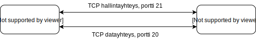

<text-box variant='learningObjectives' name='Oppimistavoitteet'>

- Osaat kuvata, miten tiedostonjakopalvelut yleisellä tasolla toimivat
- Osaat perustella, miksi ftp-protokollassa on kaksi erillistä yhteyskanavaa

</text-box>

## Tiedostonjakopalvelu

Tiedostojen jakelu oli yksi ensimmäisistä internetin palveluista. Se on ollut mukana internetin toiminnassa ihan alusta asti. Tiedostojensiirtoprotokolla FTP (File Transfer Protocol) on edelleen käytössä, vaikka sen rinnalle on tullut paljon muitakin tiedostojen siirtoon ja jakeluun suunniteltuja protokollia ja palveluja. 

Tiedostoista on siirrytty jo puhumaan sisällöstä, koska tavalliselle käyttäjälle ei ole enää merkitystä sillä onko tieto yhdessä vai useammassa tiedostossa. Sisältö on tärkeämpää. Ohjelmistopäivitysten, elokuvien ja videomateriaalin välittäminen verkossa vaatii paljon verkon kapasiteetista ja yhden yksittäisen palvelimen kautta ei voitaisi enää edes jakaa samaa määrää tietoa. Siksi onkin kehitetty erityisiä sisällönjakoverkkoja (Content Delivery Network, CDN), joiden avulla pyritään siihen, että käyttäjät saavat sisällön joustavasti eikä verkko kokonaisuudessaan tai jostain yhdestä kohtaa kuormitu liikaa.

Tutustutaan ensin tuohon perinteiseen ja yksinkertaisempaan tiedostojen siirtoon FTP ja sen jälkeen katsotaan lyhyesti näitä uudempia palveluja.

## FTP

FTP palvelu poikkeaa aiemmin tarkastellusta WWW-palvelusta monella eri tavalla. FTP-protokollan määrittelyn mukaan asiakkaan ja palvelimen välinen kommunikointi on WWW:tä monipuolisempaa ja FTP-palvelimen pitää pitää kirjaa siitä, millaisia viestejä asiakkaalta on aiemmin tullut eli FTP-palvelimella on tila. Jotta FTP-palvelin ylläpitämä tilainformaatio ei kasvaisi rajattomasti, on sovittu, että FTP-palvelin ylläpitää tilatietoa asiakkaaseen liittyen vain aktiivin istunnon ajan. Istunto on määritelty yhdeksi jatkuvaksi yhteydeksi asiakkaan ja palvelimen välillä. Kun tämä yhteys päättyy tai katkeaa, niin palvelin voi unohtaa asiakkaan ja siihen liittyvän tilatiedon. Erityisesti hakemiston vaihdot muuttavat asiakkaaseen liittyvää tilatietoa. Tilatiedon osalta FTP-palvelin poikkeaa aiemmin tarkastelemastamme WWW-palvelimesta. WWW-palvelimen ei tarvitse ylläpitää tilatietoa, joten sen ei tarvitse lainkaan välittää siitä mitä asiakas on aiemmin tehnyt. FTP-palvelin puolestaan täytyy tietää esimerkiksi mikä on asiakkaan aktiivien työhakemisto juuri nyt.

Jatkuva yhteys asiakkaan ja palvelimen välillä on nimetty kontrolliyhteydeksi. Sitä pitkin asiakas välittää kaikki toimenpidepyynnöt palvelimelle. Tyypillisiä toimenpidepyyntöjä ovat hakemiston tiedostolistaus, hakemiston vaihto, tiedosto nouto- ja tallennuspyynnöt.

Varsinaista tiedoston siirtoa varten asiakas ja palvelin avaavat uuden erillisen yhteyden, jossa tiedoston siirto tapahtuu. Tämä datayhteys suljetaan heti, kun tiedosto on siirretty.

Asiakas ottaa siis aluksi yhteyttä palvelimen porttiin 21. Tämä on tuo kontrolliyhteys, joka on avoinna koko toiminnan ajan. Tiedostonsiirtoa varten yhteyden muodostamisen aloittaa palvelin, joka ottaa yhteyttä asiakkaan porttiin 20. Kun yhteys on muodostettu, tässä yhteydessä välitetään vain tiedoston sisältö sellaisenaan. Kun tiedosto päättyy, niin palvelin sulkee tämä datayhteyden.

Palvelin voi muodostaa datayhteyden vain, kun molemmilla laitteilla on julkinen IP-osoite (tai molemmat ovat samassa yksityisessä verkossa). Näin oli todella pitkään internetin alkuvaiheissa. Tätä kutsutaan aktiivimoodiksi, koska palvelin on aktiivinen yhteyden muodostaja. Myöhemmin, kun yksityisten verkkojen yhdistäminen julkiseen verkkoon tuli NAT-toiminnallisuuden avulla yleisemmäksi, ei palvelin enää voinutkaan muodostaa yhteyttä asiakkaaseen. Jotta NATin takana oleva asiakaskin voisi käyttää FTP-palvelua on sen muodostettava tuo datayhteys. Tätä varten asiakkaan pitää pyytää palvelinta siirtymään passiivimoodiin ja kertomaan mihin IP-osoitteeseen ja porttiin asiakkaan pitää yhteys muodostaa. Tiedostonsiirto toki tapahtuu samoin kuin aktiivimoodissa, mutta aloitteentekijä yhteyden muodostuksessa on eri.

Kontrolliyhteyden ja datayhteyden erottaminen on suhteellisen tavanomaista nykyisissä palveluissa. Tämä ratkaisumalli on siis paljon yleisempi, koska se usein helpottaa järjestelmän toteuttamista. Joskus erilaisille toiminnoille muodostetaan jopa useampiakin yhteyksiä, jotta eri toiminnot voidaan helpommin pitää erillään.

FTP:tä ei enää perusmuotoisena käytetä, koska se ei salaa kontrolliyhteyden viestejä. Salaamattomalla kontrolliyhteydellä asiakkaan käyttäjätunnus ja salasana siirretään selväkielisenä asiakkaalta palvelimelle. Nykypäivänä tätä ei enää pidetä millään tavalla turvallisena toimintana. Modernit FTP-palvelut käyttävät kuljetuskerroksella salaamattoman TCP:n sijaan salattua kuljetuskerroksen protokollaa. Näin voivat varmistaa käyttäjätunnuksen ja salasanan turvallisuuden hieman paremmin muuttamatta kuitenkaan perinteistä FTP-protokollaa. 

Funet ylläpitää edelleen [FTP-palvelua ftp.funet.fi](ftp://ftp.funet.fi). Se oli aikoinaan merkittävä suomalainen tiedostojenjakopalvelu. Esimerkiksi LINUX-käyttöjärjestelmän ensimmäiset versiot olivat jaossa nimenomaan sen kautta.

FTP-palveluissakin pyritään välttämään verkon kuormittamista käyttämällä erityisiä peilisolmuja (Mirror site), joihin tiedostoja siirretään lähemmäs oletettuja käyttäjiä. Käyttäjän tehtäväksi jää päättää, mikä mahdollisista peilisolmuista olisi itselle sopivin ja ottaa sitten yhteyttä suoraan siihen. Aikoinaan peilisolmun valinta oli erittäin tärkeeä, koska se vaikutti merkittävästi tiedoston latausaikaan. Lähellä ja nopean yhteyden takana olevalta peililtä tiedosto saattoi tulla minuuteissa, kun kauempana olevalta peililtä latausaika saattoi olla tunteja.

## Sisällönjakeluverkko

Sisällönjakeluverkot on kehitetty nykyisen internetin käyttötapoihin sopiviksi. Vaikka FTP ja muut puhtaasti tiedostojen jakeluun kehitetyt järjestelmätkin edelleen toimivat, niin sisällönjakeluverkkojen keskeinen tavoite on taata häiriötön datan kulku palveluntarjoajalta asiakkaalle. Ne pyrkivät voimakkaasti vähentämään verkkoliikennettä ja näin säästämään tietoliikennekustannuksia. Laajimmat maailmanlaajuiset verkot toimivat ainakin osittain internetin ulkopuolella, jotta jakeluverkon ylläpitäjällä on täysi kontrolli verkossa liikkuvaan tietoon ja mahdollisuus kontrolloida datan siirtoaikoja. Tällöin verkosta on useita erillisiä liityntäpisteitä, joista sisältöä jaellaan internetissä oleville asiakkaille.

Wikipediassa on [lyhyt kuvaus sisällönjakeluverkoista](https://fi.wikipedia.org/wiki/Sis%C3%A4ll%C3%B6njakeluverkko). Kuvauksessa on mainittu useita kaupallisia toimijoita, joilla on omia sisällönjakeluverkkoja.

Yleensä käyttäjä käyttää jotain sovellusta, joka sitten sisäisesti käyttääkin sisällön siirtoon jotain tiettyä sisällönjakopalvelua tarjoavaa organisaatiota. Käyttäjällä ei välttämättä ole edes käsitystä siitä, että tieto kulkeekin erillisen sisällönjakelijan kautta. Hyvä esimerkki tästä on Ylen vuonna 2015 laatima [kuvaus Areena-palvelun toiminnasta](https://yle.fi/aihe/artikkeli/2015/01/15/nain-areenan-jakelu-toimii).

NOTE: Muistathan, että käytän termiä käyttäjä ihmisistä ja termiä asiakas laitteesta tai sen ohjelmistosta. Käyttäjä siis käyttää esimerkiksi tablettia, joka asiakkaana ottaa yhteyttä erilaisiin verkon palveluihin.

-- Tehtävä: Tiedostojakelu
<quiznator id="5c820d9e244fe21455cbd3a6"></quiznator>

